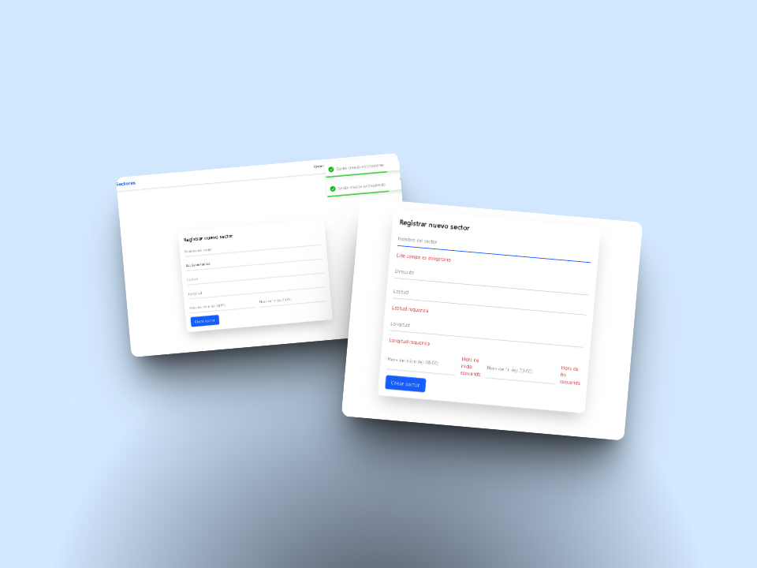
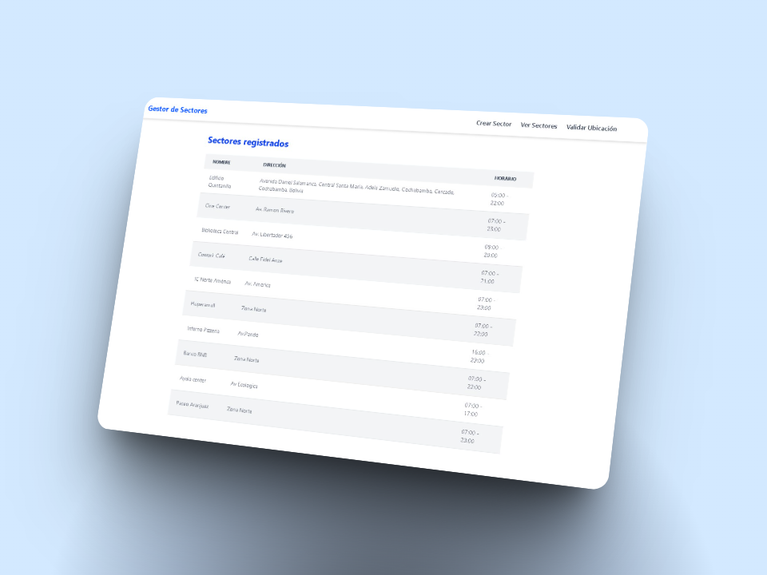
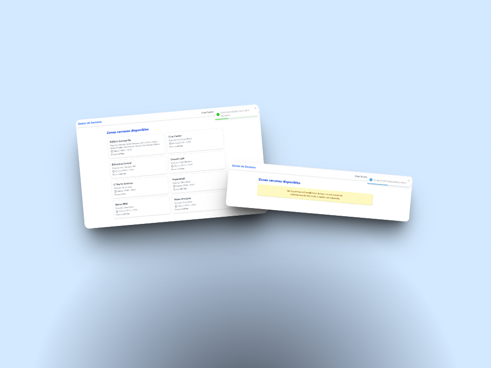
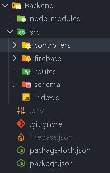

# Sistema de Domicilios por Sector

Aplicación fullstack para registrar zonas con servicio de delivery, consultar sectores activos y validar si un usuario está dentro del rango de cobertura y horario.

---

## 📸 Vista previa del proyecto

_Añade aquí tus screenshots del frontend y funcionalidades_

## Formulario con autocompletado de direcciones



## Tabla con sectores en tiempo real



## Validación de ubicación del usuario



---

## Stack Tecnológico

### 🖥️ Frontend

- **React** + **TypeScript**
- Tailwind CSS
- React Router DOM
- React Hook Form
- Axios
- Context API
- Vite

### 🧠 Backend

- Node.js + Express.js
- Firebase Firestore
- Zod (validación de datos)
- dotenv
- cors
- morgan

---

## 📁 Estructura del Proyecto

### 🧩 Frontend — _React + TypeScript + ContextAPI + Custom Hooks_

- **Arquitectura**: Modular por Dominio (_Domain-Driven Folder Structure_)
- **Librerías clave**:
  - React Hook Form _(validación de formularios)_
  - ContextAPI _(estado global)_
  - Hooks personalizados
- **Stack adicional**:
  - Axios _(para peticiones HTTP)_

Frontend/<br>
├── node_modules/ <br>
├── public/<br>
├── src/<br>
│ ├── api/ #Peticiones HTTP<br>
│ ├── components/ # Componentes reutilizables (en progreso o centralizados)<br>
│ ├── context/ # Contexto global de sectores<br>
│ ├── error/ # Manejo de errores<br>
│ ├── hooks/<br>
│ ├── pages/ #Paginas de la web<br>
│ ├── services/<br>
│ ├── types/<br>
├── app.tsx<br>
├── main.tsx<br>
├── package.json<br>
└── tsconfig.json<br>

---

### 🔧 Backend — _Express + Firebase + Zod_

- **Arquitectura**: MVC + Modular
- **Base de datos**: Firebase
- **Validación**: Zod
- **Librerías adicionales**:
  - `dotenv` _(variables de entorno)_
  - `cors`, `express` _(configuración base de servidor)_

Backend/<br>
├── node_modules/<br>
├── src/<br>
│ ├── controllers/<br>
│ ├── firebase/<br>
│ ├── routes/<br>
│ └── schema/<br>
├── .env<br>
├── .gitignore<br>
├── firebase.json<br>
├── package.json<br>
└── package-lock.json<br>

---

## 🚀 Funcionalidades principales

### ✅ Backend

- Registro de sectores con:
  - Nombre
  - Dirección geográfica (lat/lng)
  - Horario de atención
- Base de datos en Firebase Firestore
- Arquitectura modular: MVC
- Validación de datos con Zod

### ✅ Frontend

- Formulario para crear sectores
  - Autocompletado de direcciones reales (API Nominatim / Mapbox)
  - Validación con React Hook Form
- Tabla de sectores
  - Visualización en tiempo real
- Validación de ubicación del usuario
  - Muestra si se encuentra dentro de un sector activo (radio 5km)
- Manejo de estado global con ContextAPI
- Diseño responsivo con Tailwind


## 🛠️ Instalación y uso

Sigue los pasos según el entorno del proyecto para levantar la app de forma local.

### 1️⃣ Clonar el repositorio

```bash
git clone https://github.com/BernardoPer19/Prueba-FullStack.git
cd repositorio
```

> 📁 Asegúrate de tener las carpetas `frontend/` y `backend/` correctamente estructuradas en el proyecto local.

---

### 2️⃣ Levantar el backend (Express + Firebase)

#### Requisitos:

- Node.js instalado (versión recomendada: ≥ 18)

#### Pasos:

```bash
cd Backend
npm install         # Instala las dependencias
npm run dev         # Inicia el servidor en modo desarrollo (por defecto en el puerto 3000)
```
>🧩 El backend utiliza Express, Firebase como base de datos, Zod para validaciones y dotenv para configuración de variables si fuera necesario
>(aunque en este proyecto no se incluye el archivo .env por defecto, pero sí un .env.example de referencia).
---

## 🔐 Acceso a Firebase

Para garantizar la seguridad del proyecto, el archivo de credenciales de Firebase (`firebase.json`) **no está incluido en el repositorio**, ya que contiene claves privadas sensibles.  
📩 **Te enviaré este archivo directamente por correo privado** junto con las instrucciones para ubicarlo correctamente en el proyecto:

1. Descarga el archivo `firebase.json` que te enviaré por correo.
2. Colócalo en la raíz del directorio `backend/`, así:<br>

3. Asegúrate de que el archivo `.env` tenga la siguiente variable configurada:

```env
GOOGLE_APPLICATION_CREDENTIALS=firebase.json
```
4. Si no existe un archivo .env, renombra el archivo .env.example a .env:
**.env.example ===>.env**
---

### 3️⃣ Levantar el frontend (React + Vite)

#### Requisitos:

- Node.js instalado (versión recomendada: ≥ 18)

#### Pasos:

```bash
cd Frontend
npm install         # Instala las dependencias
npm run dev         # Inicia el servidor de desarrollo en http://localhost:5173
```

> 💡 El frontend está desarrollado con React, TypeScript, Vite, Tailwind CSS, Axios, ContextAPI y React Hook Form para validación de formularios.

---

### ✅ Verificación del correcto funcionamiento

- Una vez levantado el backend y el frontend, abre tu navegador en `http://localhost:5173`.
- Prueba registrar un nuevo sector desde el formulario y verifica si se visualiza en la tabla en tiempo real.
- Luego, dirigite a la sección de **validación de ubicación actual del usuario** para verificar si estás dentro de algún sector activo.

> ⚠️ Si estás usando una computadora de escritorio, **no olvides configurar manualmente tu ubicación en las herramientas de desarrollo del navegador**. Consulta la siguiente sección para más detalles:⚠️

---

<br>
<br>

## ⚠️Importante: Configurar Ubicación en Herramientas de Desarrollo

Si estás usando la aplicación desde una **PC de escritorio o laptop**, es posible que la detección automática de ubicación **no funcione correctamente** si no configuras manualmente la ubicación en las herramientas del navegador.

Para evitar errores en la validación de sectores según la ubicación del usuario, debes seguir estos pasos:

### 🧭 Cómo configurar la latitud y longitud desde el navegador (Google Chrome)

1. Abre tu navegador en la sección que valida la ubicación del usuario.
2. Presiona `F12` o haz clic derecho y selecciona **"Inspeccionar"** para abrir las herramientas de desarrollo.
3. Ve a la pestaña **"Sensors"**. Si no aparece:
   - Haz clic en los tres puntos (`⋮`) dentro del panel de herramientas.
   - Luego selecciona `More tools > Sensors`.
4. En la sección **Location**, selecciona **"Custom location..."**.
5. Ingresa las coordenadas (`Latitude` y `Longitude`) del lugar que quieras simular.
   - Ejemplo:
     - `Latitude: -17.3895`
     - `Longitude: -66.1568` (Cochabamba, Bolivia)

> 💡 Esto es crucial para que la aplicación determine si estás dentro de un sector válido de entrega. Si no lo haces, la validación fallará por defecto.

---

### 📷 Ejemplo visual

#### 1. Abre las DevTools (F12) y selecciona "Sensors"


#### 2. Cambia la ubicación manualmente


---
> ❗ Esta configuración solo es necesaria en computadoras o entornos donde el navegador no puede acceder a tu GPS real.


## 👤 Autor

- **Nombre:** Agustín Bernardo Peredo Rodriguez
- **Correo:** wawxper08@gmail.com
- **Teléfono:** +591 64854829
- **Ubicación:** Cochabamba, Bolivia
- **LinkedIn:** https://www.linkedin.com/in/bernardo-peredo-50a1552a0/

---
